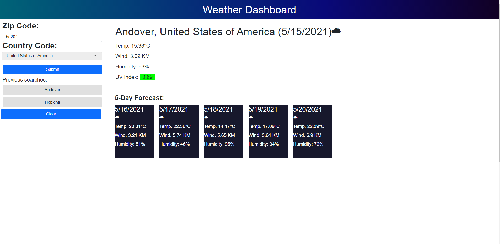

# Weather Dashboard

## Description:
This application is a weather tracking application that tells you the current 

temperature, weather conditions, wind, humidity, and UV index. It also gives a 

five day forecast of the same things, except the UV index. You can search by 

postal code and country.

## Table of Contents:

- [Installation](#installation)
- [Usage](#usage)
- [Credits](#credits)
- [License](#license)

## Installation:

Play through the story [here](https://justinean.github.io/weather-dashboard/). 

All of the files are also available through a simple download and clone from this GitHub, which you can then open in your browser from your local machine. 

## Usage:

Navigate to [Weather Dashboard](https://justinean.github.io/weather-dashboard/). 

Search for any postal code, and make sure that postal code is correct for the country that is currently selected. The countries are sorted alphabetically.

Your searches will be saved so you can just click one button to search for that location again. You can clear the previous searches with the clear button.

## Credits:

Our Team and their GitHub profiles: 
[Justin](https://github.com/Justinean)

## License:

This application is licensed under the [MIT](https://github.com/microsoft/vscode/blob/main/LICENSE.txt) license. 
